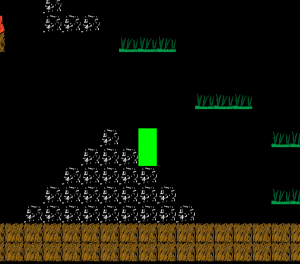

# enchantedForest



This game gets its _roots_ from ancient Norse Mythology. Maybe.

# Plot thoughts
what if npcs are the teleporters? [[ note: this would make the code easier... like if we had npc bob, then it would always teleport to a certain room etc... ]]

# Controls

## Movement
- A/LEFT, D/RIGHT, space
## moves
- c: coinshot
- x: fireball
- z: teleport (to be implemented)

# TODO

## BUGS
- if your screen is too small because e.g. you have dev console open, then the dialogue box gets pushed down...
- mobs dont die if they fall off screen
- lag??
-
- don't delete items on room change

## Both
- code cleanup [[e.g. increase encapsulation]]

## ALEK legit

- do AI stuff
  - flying swarm behavior
  - queen in the center, if queen struck down everything dies
  - bats!
- do sprites.json (add the unicorn)
  - you can specify custom dimensions, number of frames, and collision boxes for all sprites

## KEVIN legit
- SPRITE SHEEETS

- progress of ongoing quests (display details and requirements)
- items
  - should have info stuff appear in HUD about what the items do
  - should be able to use the items
- stats system 
    -   on levelup and stuff you can upgrade stats
    -   e.g. you can boost speed, strength, etc
- save progress
  - literally just JSON.stringify(player)
  - put it on local computer for now :(
  - load it up with a `$.getJSON`


## Alek

- mob types:
    - damage on impact
    - projectile mobs
    - boss mobs

- player has quest arrow
- cool names

- fix teleportation system (the teleport thing needs to say where is teleports you to...)


## Kevin
- clean up inventory system
- item usage e.g. onclick for potion -> mana
- concept art (sprite sheets 32x32 gimp)
- dialogue boxes (GUI) ADD NEXT CONVO MECHANISM
- add pictures to the HUD / just make it look nice
- attacks (complete weapon sytem)
  * fireballs explode upon impact
  * affecting enemies
- movement
  * teleportation

## Up for grabs MISC
- mobs walk on walls
- smiths / scrolls / other npcs  to update weapons 
- weapon and armor system
  -   update weapons.json
  -   hud stuff
- check for screen resize, then resize canvas
- movement
  * dashing
  * markers 
  * flight
  * coinshot flight
- support
  * shields
  * healing
  * upgrades
  * inventory system
      * talismans
      * money
  * objects
  * quests
  * minimap
- map design
- game plot 
- mysql data saving
- mobs dropping loot

# Done 

Feb 3
- fix collision detection:
  - for npcs (if you get kinda close it flashes)

1/27/2020
- basic dialogue box system
- Inventory system

1/25/2020
- mana regen
- clock
- removing irrelevant projectiles
- projectiles harm mobs
- added items that go into inventory

1/24/2020
- mana system
- rudimentary fireball tossing
- using external jsons for game data

1/23/2020
- collision detection (diagonal stuff broken)
- dying / respawn
- dialogue boxes / npcs
- world system (portals, doors)
- fast collision detection (its a freaking grid! collision detection can be supah fast, literally just check like the 6 squares that the player is touching and see if any of those have things that it's hitting in them)
- loading screen, trigger past it with a callback function
- mobs 

## Game documentation 

## tilemaps

### in order to add a new tile
- go into `data/maps/tileset.tsx` (its secretly an `xml`)
- add a tile, basically copy this:
```
 <tile id="8">
  <properties>
   <property name="name" value="teleporter"/>
  </properties>
  <image width="32" height="32" source="gimpTiles/teleporter.png"/>
 </tile>
```
- but replace the `path` and the `id` and the `source`
- (you can do this from the Tiled gui too, but its less fun)

## in order to write a map
- design the map in tiled
- save it
- export it as an image to tilemap.png in the appropriate room directory
- run `sh compileMaps.sh` from project root directory (this writes `map.json`)

### map design notes
- note that the player is 2 tiles high, so any "tunnel" in the tilemap needs to be 3 tiles high for the player to be able to go in it. The player can walk through a tunnel that is 2 high if it is flush with the ground (i.e. the player doens't need to jump to get into it)
- at least for now, the player can jump 3 tiles, that is, if it is on the ground and there is a stack of tiles 3 high, the player can jump onto the top of this

## json docs

quest.json
```
[
"gettingStarted": {
  "prereqs": [], // a list of quest ids (quest ids and quest names are the same)
  "rewards":{"xp": 10},
  "task": { // types of task: killing mobs, boss fights, collecting items, talking to npcs
    "type": "hunt", // hunt/boss/gather/talk
    "species": "ogre", // this depends on the thing 
    "quantity": 10 // this depends on the thing , note: quantity is "1" for binary things, e.g. "talk to bob" YES ALL QUESTS MUST HAVE A quantity associated with them
  },
  "followups": ["quest2"]
}
]
```

```
{
"startRoom": [
  {
    "name": "dawg",
    "proposeQuest": "gettingStarted",
    "dialogue": "heyo, im an npc"
  }
]
}
```

## General advice: have exactly 1 name for everything
The names in things like npcs.json instruct the program where to look for imgs. For example, if an image is named "dawg" in `npc.json` then it's image is at `data/avatars/dog.png` or something

## Interface schema
Dialogue box has all the details, descriptions, etc (arrow keys to go through)
  -options to set quick access
Quick access displays clickable 10 items

