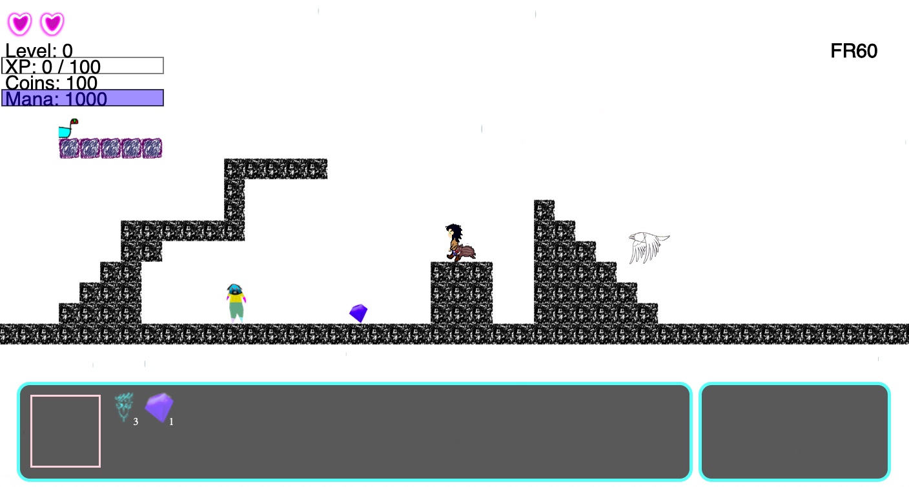

# enchantedForest

This game gets its _roots_ from ancient Norse Mythology. Maybe.

# Controls

## Movement
- A/LEFT, D/RIGHT, space
## moves
- c: coinshot
- x: fireball
- z: teleport (to be implemented)

# Objectives
- Follow the quests
- Kill some bad guys
- see the book for more detail on the plot of the rpg

--------------------------------

# TODO

## BUGS
- don't delete items on room change

## ALEK current

- do AI stuff
  - flying swarm behavior
  - queen in the center, if queen struck down everything dies
  - adapt dijkstras to walkers (gravity => need a jump stage indicator on each tile => woah thats gonna be a massive graph)
- plot plot plot

## KEVIN current
- SPRITE SHEEETS

- progress of ongoing quests (display details and requirements)
- items
  - should have info stuff appear in HUD about what the items do
  - should be able to use the items
- stats system 
    -   on levelup and stuff you can upgrade stats
    -   e.g. you can boost speed, strength, etc
- save progress
  - literally just JSON.stringify(player)
  - put it on local computer for now :(
  - load it up with a `$.getJSON`

### FAR FUTURE TODOs 

## Alek FUTURE

- mob types:
    - damage on impact
    - projectile mobs
    - boss mobs

- player has quest arrow
- cool names

- fix teleportation system (the teleport thing needs to say where is teleports you to...)

## Kevin FUTURE
- clean up inventory system
- item usage e.g. onclick for potion -> mana
- concept art (sprite sheets 32x32 gimp)
- dialogue boxes (GUI) ADD NEXT CONVO MECHANISM
- add pictures to the HUD / just make it look nice
- attacks (complete weapon sytem)
  * fireballs explode upon impact
  * affecting enemies
- movement
  * teleportation

## Up for grabs MISC
- Gravity/armor weight system
- mobs walk on walls
- smiths / scrolls / other npcs  to update weapons 
- weapon and armor system
  -   update weapons.json
  -   hud stuff
- check for screen resize, then resize canvas
- movement
  * dashing
  * markers 
  * flight
  * coinshot flight
- support
  * shields
  * healing
  * upgrades
  * inventory system
      * talismans
      * money
  * objects
  * quests
  * minimap
- map design
- game plot 
- mysql data saving
- mobs dropping loot

 
--------------------------------

# Done 

Feb 20

Feb 3
- fix collision detection:
  - for npcs (if you get kinda close it flashes)

1/27/2020
- basic dialogue box system
- Inventory system

1/25/2020
- mana regen
- clock
- removing irrelevant projectiles
- projectiles harm mobs
- added items that go into inventory

1/24/2020
- mana system
- rudimentary fireball tossing
- using external jsons for game data

1/23/2020
- collision detection (diagonal stuff broken)
- dying / respawn
- dialogue boxes / npcs
- world system (portals, doors)
- fast collision detection (its a freaking grid! collision detection can be supah fast, literally just check like the 6 squares that the player is touching and see if any of those have things that it's hitting in them)
- loading screen, trigger past it with a callback function
- mobs 

------------------

# Namey things & Plot

  | Game           |                |
  | Money          | Seg        |
  | Dead companion | Bucky/Buchanan |
  | Protagonist    | Bob            |
  | World          | Llama Land    |
  | Dragon         | Malimost       |
  | Magic source   | The Levant     |
  | Magic system   | Levancy        |
  | Magic users    | Levanters      |

* Overall plot: 

  Bob, the weary traveller, discovers his magic capabilities for the first time. 
  Stephan mentors him on learning his abilities. 
  A dragon, Malimost burns down Bob's village. 
  Buchanan "dies". jumpydude comes in as replacement companion. 
  Bob ventures into the dragon's homeland and seeks revenge. 

  Sketchy npc makes you massacre an entire village 
  Murders Malimost, becomes the dragon, every hates you, wanders the world alone PLOT TWIST EVERYBODY
  Dragon armor, multiple npcs challenges them
  Confronted by a key npc (Buchanan) that notifies the player that they are the villain
  flashback: jumpydude tried to murder buchanan but failed
  "I did this for you!!!"
  Upon realizing they are the villain, the player sacrifices themselves as the redemption arc
  final boss: jumpydude (basically palpatine v6.2.0)

* Npc names
  - Alice
  - Eve
  - Azriel
  - Nova
  - Serena
  - jumpydude (guy that leads you to do the sketchy stuff)
  - Cassandra (reoccuring oracle that gives info)
  - Call of the Blessed (cult you encounter along the way)
  - (reoccuring merchant)
  - npc that consistently calls protagonist noobie

* Enemies: 
  - dragons
  - bats
  - skeletons
  - Leviathan

* Items: 
  - Urim & Thummim
  - Blade of smoke

* geographically-based (eg. fire levant, wind levant)
* Abilities: 
  - Melee (swords)

  - teleportation
  - flight

  - undead minions (necromancy)
  - npcs helping you in a fight (eg. buchanan)

* Areas: 
  - llama land (melee + spitting on enemies + summon llama-unicorn)
  - storm (lightning + wind/tornado + rain)
  - plant control (vine whip, earthquakes)

* introduce shadow area upon buchanan's death
  - shadow (induces insanity/unfurling shadows-based attacks + necromancy)
  - dragonfire (flames)
  - jumpydude fortress (iron walls, shoot spikes)

## Semi-detailed plot outline
  - llama land 
    - give background
    - tutorial
    - introduce buchanan
    - establish Malimost as the villain (murders an entire village of dogs)
    - too weak to kill Malimost
  - storm
    - Leviathan (skull makes you fireproof, able to enter fire area after this)
    - get key
  - plants
    - get key
    - Buchanan dies
  - shadow
    - meet jumpydude
    - gain first minion through necromancy
    - get key
    - allowed to murder npcs
    - steals potion from a sick/dying npc
  - outer space
    - murders an entire village
    - teleport to dragon fire using all the keys
  - dragon fire
    - kills malamir
    - bucky comes back
    - realizes they've been playing as the villain the entire game  
  - jumpydude fortress
    - sacrifice
    - kills jumpydude
    - the end

## dark vs light Levancy
dark levancy is just a tinted version of light levancy
it is more powerful, but it comes at a cost, namely it makes you evil (greedy, powerhungy etc)

dark levancy: you can steal the powers of others
light levancy: they can only be freely given

## characters

- Malimost:
  - Family slaughtered as a youth, driven on a quest to control who has access to the Levant
  - He only really allows people to possess it if they swear a magically binding oath (he has an item, the bondstone that enables this, people will burn up if they break the vow) to obey him.
  - He seeks out any "rogue" Levanters and forces them to either bond to him or die.
  - he is very paranoid
  - people have legends about the Levant being used for great things => unhappy
  - some communities of rogue levanters exists and resist

- Bob:
  - "rogue" Levanter, doesnt really know about his powers
  - Home destroyed by malimost's minions because they offended them somehow, maybe rebelled
  - wants revenge (initially) 
  - after learning more about the Levant (and his turning point) he actually wants to bring back free use of the Levant for the good of people

- Bucky: 
    - loyal sidekick guy

# Area details

## Llama Land
  - Levanter's keep cave (reoccuring)
    - Door (interactive)
    - Glowing Torches on the wall (decorative)

    - shopkeeper/merchant npc (unlock wares on levelup)
    - ELEPHANT (informant)

    - Accept Quest "Kill 5 boars" (unlocks Unicorn Lair)
    - Boss Fight "Kill 1 unicorn" 

  - Llama Plains
  - Unicorn Lair

  - In order to make a functional llama land
    - Kevin 
      - Draw stuff
      - Life system (100hp)
      - Fix merchant menu
      - Decrease opacity of weather conditions
    - Alek
      - Make a tilemap
      - Fix npc quest giving (they need to be able to give multiple quests; im pretty sure we dont check prereqs; if you already accepted the quest you cant exit conversation) 
      - Fix teleporters (and do other room trait reading stuff)

      - Write relevant plot

- fireflies passing on messages and leading the way
- shopkeeper cant use the levant, which is why he needs wings, used to be brilliant at fighting, ?dies later on in the story?

refer to fireflies as
  - glowwyrms
  - candlewyrms
  - lanternwyrms
  - firewyrms

deity name
  - lampyris
  - lucidota

  - lampyridae
  - luciola
  - luciole

Collect
  - scrolls
  - gems
  - abilities
  - weapons/armor/parts of an artifact

